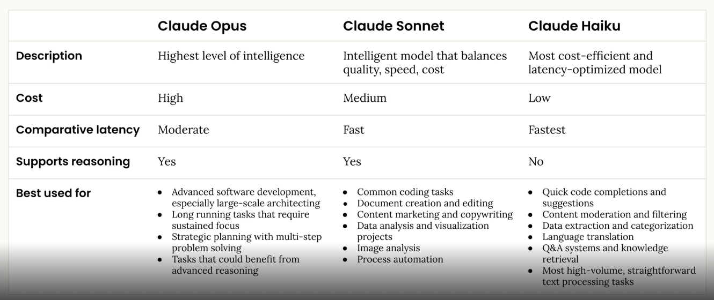

# Building with the Claude API - Short Note

- Claude Model Family
  
  - **Selection criteria**: Choose based on your task requirements—complexity, speed, and cost
  - **Claude Opus** (Highest capability)
    - Description: Highest level of intelligence
    - Cost: High
    - Latency: Moderate
    - Supports extended reasoning: Yes
    - Best used for: Advanced software development, long-running tasks requiring sustained focus, strategic planning, multi-step problem solving, tasks benefiting from advanced reasoning
  - **Claude Sonnet** (Balanced)
    - Description: Intelligent model that balances quality, speed, and cost
    - Cost: Medium
    - Latency: Fast
    - Supports extended reasoning: Yes
    - Best used for: Common coding tasks, document creation and editing, content marketing and copywriting, data analysis and visualization, image analysis, process automation
  - **Claude Haiku** (Fast and cost-efficient)
    - Description: Most cost-efficient and latency-optimized model
    - Cost: Low
    - Latency: Fastest
    - Supports extended reasoning: No
    - Best used for: Quick code completions and suggestions, content moderation and filtering, data extraction and categorization, language translation, Q&A systems and knowledge retrieval, high-volume straightforward text processing

- API
  - Architecture example:

  ```mermaid
    graph TD
        FE["🖥️ Frontend\n(Web / App)"]

        subgraph BE["Backend Server"]
            API["REST / GraphQL API (Route handlers)"]
            SDK["Anthropic SDK (Node / Python)"]
        end

        EXT["☁️ Anthropic API"]

        FE -->|"HTTP request"| API
        API -->|"Returns response"| FE
        API -->|"Calls SDK method"| SDK
        SDK -->|"HTTPS POST /v1/messages"| EXT
        EXT -->|"Streams / returns completion"| SDK
  ```

  - **Security note**: Keep API secret keys secure—never expose them in frontend code

  - **Tokenization**: How Claude processes text
    - Breaks input text into tokens (chunks of text)
    - Converts each token into **embeddings** (a list of numbers representing the token's meaning)
    - Contextualizes tokens by analyzing surrounding tokens to determine the correct meaning in context
    - This multi-step process enables Claude to understand nuance and context

  - **Processing pipeline**: `Input request → Tokenization → Embedding → Contextualization → Generation → Output response`

  - **API Request Structure**:

    ```python
    client.messages.create(
      model="claude-opus-4-20250514",  # name of model
      max_tokens=1000,  # caps the length of the response to N tokens
      messages=[  # input to the model
        {
          "role": "user",
          "content": "What is quantum computing? Answer in one sentence"
        }
      ],
      system="""
        You are a helpful AI assistant.
        Be concise and clear in your responses.
      """,  # system prompt: sets persona, mood, and tone
      temperature=0.7,  # controls randomness/creativity
      stream=True  # enable streaming responses
    )
    ```

  - **Temperature parameter** (controls creativity vs consistency):
    - **Low (0.0–0.3)**: Deterministic, consistent responses
      - Best for: Factual content, coding, data extraction, content moderation
    - **Medium (0.4–0.7)**: Balanced creativity and consistency
      - Best for: Summarization, educational content, problem solving, creative writing with constraints
    - **High (0.8–1.0)**: High creativity, more varied responses
      - Best for: Brainstorming, creative writing, marketing content, joke generation

  - **Multi-turn Conversations**
    - The Anthropic API does NOT store conversation history
    - You must manually collect previous messages and responses
    - Include them as an array in the "messages" parameter for each request
    - This gives you full control over what context to include

  - **Response Streaming**
    - Full responses typically take 10–30 seconds
    - Streaming provides real-time token-by-token responses for better UX
    - Stream event types:
      - `RawMessageStartEvent` — signals the start of a response
      - `RawContentBlockStartEvent` — signals the start of a content block
      - `RawContentBlockDeltaEvent` — incremental content update
      - `RawMessageDeltaEvent` — changes to message metadata
      - `RawMessageStopEvent` — signals the end of the response

  - **Structured Output**
    - Ask Claude to generate responses in structured formats (JSON, etc.)
    - Combine with prefilled messages and stop sequences for more control

- Prompt Evaluation
  - **Prompt Engineering**: Set of practices and techniques to improve your prompts
  - **Prompt Evaluation**: Automated testing to measure prompt effectiveness and compare versions

  - **Evaluation Workflow**:
    1. **Draft initial prompt**

       ```python
       f"""
       Please answer the user's question:
         {question}
       """
       ```

    2. **Create an eval dataset**
       - Contains test questions to merge with your prompt
       - Can be created by hand, with Claude, or with Haiku (faster, cheaper for variety)

    3. **Feed through Claude** and get responses

    4. **Grade responses** using:
       - **Code-based grading**: Output length checks, word verification, syntax validation (JSON/Python/regex), readability scores
       - **Model-based grading**: Response quality, instruction following, completeness, helpfulness, safety
       - **Human grading**: General quality, comprehensiveness, depth, conciseness, relevance

    5. **Refine and repeat** until satisfied

- Prompt Engineering Best Practices
  - **Set a clear goal**
    - Example: "Write a prompt that generates a 1-day meal plan for an athlete based on height, weight, goal, and dietary restrictions"

  - **Write an initial prompt**
    - Be clear and direct
    - Use one-shot or multi-shot prompting (provide examples)
    - Specify:
      - Guidelines or process steps
      - Structure with XML tags for clarity
      - Example output format

  - **Evaluate the prompt** against your criteria

  - **Apply engineering techniques** to improve it

  - **Re-evaluate** to verify improvements

- Tool Use (Function Calling)
  - **When to use**: Check the `stop_reason` field for value `"tool_use"`

  - **Define tools in JSON**: Specify function name, parameters, descriptions, and expected arguments

  - **Tool function example**: Abstract tools like `get_weather(location)` that fetch external data

  - **ToolUseBlock**: Defines function name, input format, and expected behavior

  - **Multi-turn tool use**: After Claude requests a tool, return results in this format:

    ```json
    {
      "type": "tool_result",
      "tool_use_id": "tool_request_id",
      "content": "actual_tool_output_as_json",
      "is_error": false
    }
    ```

  - **Multiple tools**: Pass array of tool schemas to the API

    ```python
    response = client.messages.create(
      messages=messages,
      tools=[
        get_current_datetime_schema,
        add_duration_to_datetime_schema,
        set_reminder_schema
      ]
    )
    ```

  - **Tool router**: Implement conditional logic to execute the correct function based on Claude's tool request

    ```python
    def run_tool(tool_name, tool_input):
      if tool_name == "get_current_datetime":
        return get_current_datetime(**tool_input)
      elif tool_name == "add_duration_to_datetime":
        return add_duration_to_datetime(**tool_input)
      elif tool_name == "set_reminder":
        return set_reminder(**tool_input)
    ```

  - **Text editor tool**: For file editing and reading via code or Claude-powered interfaces; Claude provides the schema, but you may need to implement some functionality

- Retrieval Augmented Generation (RAG)
  - **Purpose**: Technique for working with large documents that exceed single-prompt limits

  - **Approach 1: Include Everything** (for smaller documents)

    ```html
    Answer the user's question about the financial document.

    <user_question>
    {user_question}
    </user_question>

    <financial_document>
    {financial_document}
    </financial_document>
    ```

  - **Approach 2: Break Documents into Chunks** (for larger documents)

  - **When to use RAG**: Valuable for very large documents, multiple documents, or cost/performance optimization. Involves many technical decisions in prompt design.

  - **Chunking strategies**:
    - **Structure-based**: Best when you control document formatting (e.g., internal company reports)
    - **Sentence-based**: Good middle ground for most text documents
    - **Size-based**: Most reliable fallback; works with any content type including code

  - **Text embeddings**: Numerical representations of text where each number captures semantic qualities; tools like VoyageAI can demonstrate this

  - **RAG flow**:
    1. Chunk source text
    2. Generate embeddings for each chunk
    3. Store embeddings in vector database
    4. Embed user query and find closest matches using similarity search

  - **BM25 lexical search**: Alternative/complementary to semantic search
    - **Semantic search** (embeddings + vector DB) finds conceptual matches
    - **Lexical search** (BM25) finds exact and keyword matches
    - BM25 excels at finding exact matches by:
      - Giving higher weight to rare, specific terms
      - Ignoring common words that don't add value
      - Focusing on term frequency rather than semantic meaning
      - Working well with technical terms, IDs, and specific phrases

- Advanced Features
  - **Extended Thinking**
    - Gives Claude better reasoning capabilities for complex tasks
    - Use evals to determine if your task needs extended thinking
    - Provides internal reasoning space before responding
    - Configure with `max_tokens` and `thinking_budget` parameters

  - **Image Support (Vision)**
    - Token cost based on image dimensions: `tokens = (width px × height px) / 750`
    - Encode images as base64
    - Effective techniques:
      - Provide detailed guidelines and analysis steps
      - Use one-shot or multi-shot examples
      - Break complex tasks into smaller steps

  - **PDF Support**
    - Encode PDFs as base64 (like images)
    - Specify media type in request

  - **Citations**
    - Enable with: `"citations": { "enabled": true }`
    - Claude can reference specific parts of source documents
    - Shows users exactly where information comes from

  - **Prompt Caching**
    - Reduces costs when reusing the same large context multiple times
    - Minimum content length: 1024 tokens
    - Configure with: `"cache_control": {"type": "ephemeral"}`
    - Response patterns:
      - **First request**: `cache_creation_input_tokens=X` — Claude writes to cache
      - **Follow-up requests**: `cache_read_input_tokens=X` — Claude reads from cache
      - **Changed content**: New cache tokens appear when content changes

  - **Code Execution and Files API**
    - Files API: Upload files ahead of time and reference them in messages instead of encoding directly
    - Useful for processing multiple files or large files
    - Reduces token usage compared to base64 encoding

- Model Context Protocol (MCP)
  - **Purpose**: Communication layer that provides Claude with context and tools without requiring custom integration code
  - **Benefits**: Simplifies connecting Claude to external services and data sources

  - **Server Primitives**:
    - **Tools**: Model-controlled (Claude decides when to use)
    - **Resources**: App-controlled (application decides what to expose)
    - **Prompts**: User-controlled (user selects and configures)

  - **Testing**: Use MCP Inspector in your browser to test MCP servers through standard input/output

- Anthropic Apps Ecosystem
  - **Claude Code**
    - Agentic coding tool with direct codebase access
    - Initialization: `/init` creates new `CLAUDE.md` for persistent memory
    - Workflow: Feed context → Ask to plan → Ask to implement
    - Commands: `/clear` resets conversation history and context
    - Popular MCP servers: GitHub, databases, cloud services

  - **Expanding Capabilities**: MCP servers enhance Claude Code with external tool access

- Agents and Workflows
  - **Agents vs Workflows**: Choose based on task structure
    - **Agents**: For unpredictable, open-ended tasks requiring autonomous decision-making
    - **Workflows**: For structured, repeatable processes with defined steps

  - **Workflow Types**:
    - **Parallelization workflows**: Break complex problems into parallel subtasks
      - Benefits: Focused attention, easier optimization, better scalability, improved reliability
      - Reduces cognitive load on the model

    - **Chaining workflows**: Sequential steps where output of one feeds input to next
      - Useful for solving long, complex prompts

    - **Routing workflows**: Direct inputs to appropriate processing paths based on content

    - **Agent + Tools**: Agents with access to abstract tools (read_file, write_file, run_command)
      - Agent can autonomously decide which tools to use and when
