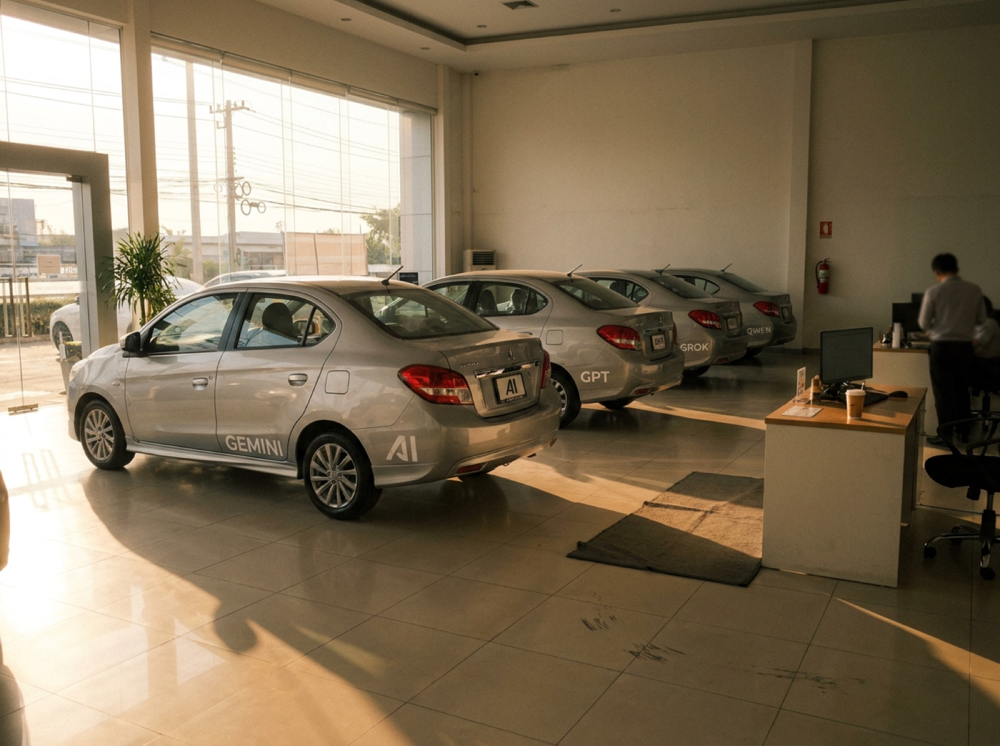
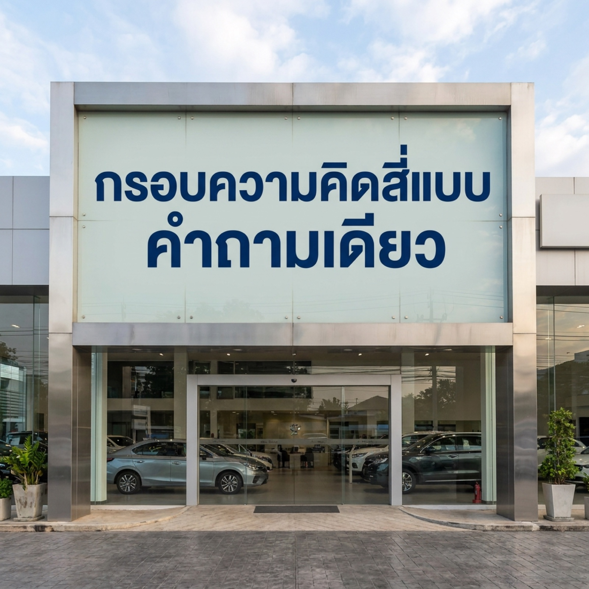

# TH-AI Passport Gave Me Four Prompt Frameworks. A 20-Minute Talk Gave Me the Better Question

> รีวิว TH-AI Passport, คอร์สฟรีของ Anthropic และ 4Ds — จากคนที่บังเอิญเรียนสามแหล่งเรียงกันโดยไม่ได้ตั้งใจ



<sub>ภาพนี้ generate บน AiPASS ด้วย Nano Banana Pro ค่ะ โครงการเอาหลายโมเดลมาวางไว้ในที่เดียวให้ลองฟรีหนึ่งปี — คุ้มไหมอยู่ในหัวข้อที่ 7 ส่วนภาพนี้ลองสองรอบกว่าจะได้ โดยรอบแรกอยู่ในหัวข้อที่ 6</sub>

ไม่กี่เดือนที่ผ่านมาภัทรเรียนเรื่องการทำงานกับ AI จากสามแหล่ง เรียงตามนี้ค่ะ: **งาน community ของ Google สองงาน** เมื่อเดือนมีนาคม ต่อด้วย **คอร์สฟรีของ Anthropic** บน Skilljar แล้วปิดท้ายด้วย **TH-AI Passport**

ไม่ได้วางแผนให้มันเรียงแบบนี้เลย แต่กลายเป็นว่า *ลำดับ* สำคัญกว่าตัวคอร์สแต่ละอันเสียอีก บทความนี้จึงไม่ใช่แค่รีวิวสามแหล่ง แต่เป็นเรื่องของการเรียนสลับลำดับโดยบังเอิญ — และภัทรจะพูดตรง ๆ รวมถึงส่วนที่คิดว่าเป็นการตลาดด้วย

---

## 1. The Setup

จุดเริ่มต้นไม่ใช่คอร์สค่ะ แต่คือ **งาน**

นี่เป็นงานแรกที่ภัทรต้องใช้ **agentic AI coding tool** เป็นส่วนหนึ่งของการทำงานจริง (เขียนแยกไว้แล้วใน [What I Learned From 4 Months Without AI Coding Tools](./four-months-without-ai-2026.md)) สิ่งที่โพสต์นั้นไม่ได้พูดถึงคืออีกครึ่งหนึ่งของปัญหา — ภัทร *รีวิว* สิ่งที่ AI ทำออกมาได้ แต่ *สั่ง* ให้ถูกตั้งแต่แรกไม่ค่อยได้ ทุกอย่างข้างล่างนี้คือการอุดช่องว่างนั้น และแต่ละแหล่งอุดคนละส่วนกัน

**ฝั่ง Google มาก่อน และตัววันงานไม่ใช่คอร์สด้วยซ้ำ** วันที่ 22 มีนาคม 2026 ภัทรไป ChaiyoGCP Season 6 ตอนเช้า แล้วต่อ Build with AI Bangkok ตอนบ่าย เต็มวันเป็น talk ล้วน ๆ ไม่มีหลักสูตร ไม่มีใบประกาศ แต่เป็นครั้งแรกที่มีคนอธิบายว่า prompt มี *โครงสร้าง* ไม่ใช่เรื่องที่ต้องเดาไปเรื่อย ๆ จนกว่าจะได้ผล วันนั้นภัทรกลับมาพร้อมโน้ตหนึ่งหน้าที่ยังไม่เข้าใจดีนัก

ส่วนที่เป็น "คอร์ส" ของฝั่งนี้คือ **[Google Skills](https://www.skills.google/)** ซึ่งภัทรได้เรียนตอน ChaiyoGCP ค่ะ — คนละของกับ talk บนเวที แต่มาจากงานเดียวกัน

**คอร์ส Skilljar ของ Anthropic มาต่อ และลงลึกกว่ามาก** ภัทรเจอตอนหาเอกสารทางการของ Claude Code ไว้ใช้ที่ทำงาน แล้วเพิ่งรู้ว่าทั้ง catalogue ฟรี สองอย่างที่โดนที่สุดกลับไม่ใช่เรื่อง prompt เลยค่ะ — คือเนื้อหา **ethics** กับคำอธิบายเชิงเทคนิคว่าระบบพวกนี้ทำงานยังไง หลายอย่างที่ภัทรทำอยู่ที่ทำงานแบบ pattern-matching ถึงได้มีเหตุผลรองรับสักที

**TH-AI Passport มาท้ายสุด และใหม่ที่สุดในบรรดาทั้งหมด** เป็นโครงการของกระทรวงดิจิทัลเพื่อเศรษฐกิจและสังคม โดย[ข้อกำหนดมีผลวันที่ 19 สิงหาคม 2026](https://aipass.go.th/term-and-cond-th) และระยะเวลาโครงการอย่างเป็นทางการคือ 31 สิงหาคม 2026 ถึง 30 สิงหาคม 2027 ให้[คนไทยอายุ 15 ปีขึ้นไป](https://aipass.go.th/about) ใช้โมเดล premium-tier จากผู้ให้บริการกว่าสิบเจ้าได้ฟรี พร้อมเนื้อหา AI literacy ภาษาไทย เป็นของที่ส่งให้เพื่อนร่วมงานสาย non-technical ได้โดยไม่ต้องอธิบายยาว สิ่งที่ภัทรได้กลับมาคือการค้นพบว่ามี *หลาย* สูตรที่ตั้งชื่อไว้สำหรับจัดโครงสร้าง prompt แต่ละอันมีลำดับและจุดเน้นของตัวเอง อันนี้ใหม่สำหรับภัทรจริง ๆ และหัวข้อที่ 3 คือสิ่งที่ภัทรคิดกับมันตอนนี้

สรุปสั้น ๆ: งาน Google ให้ **คำถาม**, Anthropic ให้ **แผนที่**, TH-AI Passport ให้ **สนามทดลอง** — เรื่องสำคัญไม่ใช่แค่แต่ละที่สอนอะไร แต่คือของที่เรียนทีหลังช่วยให้ย้อนกลับไปเข้าใจของเดิมได้ยังไง

**มี caveat หนึ่งข้อก่อนอ่านต่อ และไม่ใช่ข้อเล็ก ๆ ค่ะ** ภัทรเขียนโพสต์นี้ในสัปดาห์แรกของเดือนกันยายน 2026 งาน Google ผ่านมาห้าเดือน คอร์ส Anthropic เรียนคาบเกี่ยวหลายเดือนระหว่างนั้น — สองอันนี้ภัทรอยู่กับมันมานาน แต่ TH-AI Passport ภัทรเพิ่งใช้ได้ไม่กี่วัน ฉะนั้นส่วนที่พูดถึง TH-AI Passport ให้อ่านเป็น *first impression* ไม่ใช่คำตัดสิน หนึ่งสัปดาห์นานพอจะเห็นรูปร่างของบางอย่าง แต่ไม่นานพอจะมั่นใจว่าเห็นถูก

และ **ลำดับ** คือส่วนที่ภัทรคิดถึงบ่อยที่สุด ตอนเปิด TH-AI Passport ภัทรผ่าน AI Fluency มาแล้ว เลยไม่ได้เจอ prompting frameworks แบบมือเปล่า แต่อ่านมันบนแผนที่ที่มีอยู่ก่อน — และแผนที่นั้นเองที่อธิบายสไลด์แผ่นหนึ่งจากเดือนมีนาคมที่ภัทรจดไว้โดยไม่เข้าใจ

> One gave me a question. One gave me a way of working. One gave me tools. The order decided which was which.

---

## 2. Where the Question Started

วันนั้นภัทรเขียนแยกไว้แล้วที่ [Vibe Coding & Agentic AI: Key Takeaways from ChaiyoGCP & Build with AI Bangkok 2026](./gdg-buildwithai-2026.md) เลยจะไม่เล่าซ้ำทั้งหมด แต่มีสไลด์แผ่นหนึ่งที่ต้องอยู่ในโพสต์นี้ และภัทรเพิ่งเข้าใจว่าทำไมเมื่อหลายเดือนให้หลัง

ใน talk เรื่อง Vibe Coding คุณ Saad Hamid ขึ้นลิสต์สั้น ๆ เทียบ **powerful prompt** กับ **lazy prompt** ไว้ว่า:

- give a role
- define the goal
- **does it need AI?**
- create the vibe
- optional: add a visual

ห้าบรรทัดบนสไลด์ ใน talk ยี่สิบนาที ที่ไม่มีอะไรจะขาย ภัทรจดลงโน้ตในฐานะ "เทคนิคเขียน prompt" แล้วก็ผ่านไป เพราะหน้าตามันเป็นแบบนั้นจริง ๆ

สี่ข้อในนั้นเป็นเทคนิคเขียน prompt ส่วนอีกข้อไม่ใช่ — และภัทรต้องผ่านอีกสองคอร์สกว่าจะเห็นว่าข้อไหน สี่ข้อสอนว่า *จะถามยังไง* แต่อีกข้อถามว่า *เราควรถาม AI ตั้งแต่แรกหรือเปล่า*

> A conference slide, filed and forgotten. It took two curricula to explain what was on it.

---

## 3. Four Frameworks, One Job

ของที่เป็นรูปธรรมที่สุดที่ TH-AI Passport ให้มาคือชุด prompting frameworks สี่ตัว: **GCCTFE**, **CREATE**, **PARTS** และ **GROW**

| Framework | Expansion | เน้นอะไร | เหมาะกับ | จุดที่บาง |
| --- | --- | --- | --- | --- |
| **GCCTFE** | Goal, Context, Constraints, Task, Format, Example | ความแม่นของงาน | งาน one-shot ที่รู้ปลายทางแล้ว | ไม่พูดถึงคนอ่านหรือโทนเลย |
| **CREATE** | Character, Request, Examples, Adjustments, Type of output, Extras | เสียงและการวนแก้ | งาน content ที่ตั้งใจจะขัดหลายรอบ | หลวมเรื่อง constraints |
| **PARTS** | Persona, Aim, Recipient, Theme, Structure | ความเข้ากับผู้รับ | งานสื่อสาร — อีเมล สไลด์ สื่อการสอน | ไม่มีช่องให้ example หรือ constraints |
| **GROW** | Goal, Reality, Options, Way forward | การคิดเรื่องหนึ่งให้จบ | วางแผน โค้ชชิ่ง สำรวจทางเลือก | ไม่ใช่ prompt frame จริง ๆ ด้วยซ้ำ |

พอวางสี่อันข้างกัน ภัทรเห็นสองอย่างค่ะ

**หนึ่ง: สามในสี่ทำงานเดียวกัน ต่างกันแค่เน้นสิ่งที่คนมักลืมคนละอย่าง** GCCTFE, CREATE และ PARTS ล้วนช่วยระบุว่า AI ควรเป็นใคร เราอยากได้อะไร งานนี้เพื่อใคร คำตอบควรมีรูปร่างแบบไหน และเรามีตัวอย่างไหม GCCTFE นำด้วย task, PARTS นำด้วยคนอ่าน, CREATE นำด้วยเสียง ลำดับนั้นไม่ได้ไร้ความหมาย — มันบอกว่าเฟรมเวิร์กนั้นคิดว่าเราน่าจะลืมอะไรมากที่สุด — แต่นี่ไม่ใช่สามทักษะที่แยกกัน

**สอง: GROW ทำงานคนละอย่าง** Goal, Reality, Options, Way forward เริ่มต้นมาจากโมเดลการโค้ช มันแข็งแรงตอนใช้จัดโครง *บทสนทนา* ไม่ใช่ prompt เดียวจบ — คือให้ AI ถามถึง reality ของเราก่อน แล้วค่อยช่วยสำรวจ options ภัทรชอบอันนี้มากกว่าอีกสามอันด้วยซ้ำ แต่การเอาทั้งสี่มาวางเป็น template เทียบเท่ากันทำให้ความต่างตรงนี้หายไป

สรุปคือภัทรไม่ได้เห็น "สี่ทักษะ" ค่ะ แต่เห็น mnemonic หลายแบบสำหรับงานที่ใกล้กันมาก

> Memorising four acronyms is not the same as learning four skills.

---

## 4. The 4Ds Are the Layer Underneath

ตรงนี้แหละที่ลำดับการเรียนสำคัญ ภัทรเจอ **4Ds** ในคอร์ส **AI Fluency** ของ Anthropic *ก่อน* จะเจอเฟรมเวิร์กข้างบนส่วนใหญ่ เลยไม่ต้อง unlearn อะไรเลย แค่มีที่ให้เก็บของเข้าลิ้นชัก

AI Fluency สร้างบนสี่การเคลื่อนไหวนี้:

- **Delegation** — งานไหนเราทำ งานไหนให้ AI ทำ
- **Description** — จะสื่อสารสิ่งที่ต้องการให้ชัดได้ยังไง
- **Discernment** — จะประเมินสิ่งที่ AI ตอบกลับมายังไง
- **Diligence** — เรายังรับผิดชอบต่อผลลัพธ์นี้อยู่หรือเปล่า

ทีนี้ดูว่าเฟรมเวิร์กไปลงตรงไหน **GCCTFE, CREATE และ PARTS อยู่ใน Description ทั้งหมด** ช่วย D ตัวที่สอง แล้วไม่พูดถึงอีกสามตัวเลย ส่วน GROW เป็นข้อยกเว้นบางส่วน เพราะการดึง reality กับ options ออกมาช่วยเรื่อง Delegation ได้ — อีกเหตุผลที่ไม่ควรมองว่ามันแทนกันได้กับสามอันแรก

ย้อนกลับไปดูสไลด์ในหัวข้อที่ 2 ค่ะ give a role, define the goal, create the vibe, add a visual — สี่ข้อนี้คือ Description ล้วน ๆ แล้วก็มีข้อที่นั่งอยู่ตรงกลาง: **does it need AI?**

นั่นไม่ใช่เทคนิคเขียน prompt แต่คือ **Delegation** — D ตัวแรก — ที่ถูกถามด้วยภาษาบ้าน ๆ บนสไลด์งาน community โดยคนที่มีเวลายี่สิบนาทีและไม่มีอะไรจะขาย ไม่มี acronym ตัวไหนในสี่ตัวถามข้อนี้เลย เพราะ GCCTFE, CREATE, PARTS เริ่มทำงาน *หลัง* คำตอบเป็น "ใช่" ไปแล้ว คือเราตัดสินใจจะ prompt แล้ว มันแค่ช่วยให้ prompt เรียบร้อยขึ้น

พูดอีกแบบ: frameworks สอนว่า **"จะสั่งยังไง"** แต่คำถามบนสไลด์ถามก่อนหน้านั้นว่า **"งานนี้ควรสั่ง AI ไหม"**

ภัทรมองไม่เห็นตอนมีนาคม และมองไม่เห็นจากเฟรมเวิร์กอย่างเดียวด้วย ต้องมี 4Ds มาตั้งชื่อให้บรรทัดที่หายไปนั้นก่อน

ที่มันสำคัญเพราะ Description เป็น D ที่พังแบบเห็นชัดที่สุดและราคาถูกที่สุด — prompt ห่วยได้คำตอบห่วย เราเห็น เราแก้ใหม่ **Delegation ที่พังแย่กว่านั้น:** เรายกงานที่ควรทำเองให้ AI แล้วมารู้ตัวอีกทีสัปดาห์ถัดไป **Discernment ที่พังแย่ที่สุด:** ผลลัพธ์ดูถูก เราเลยส่งมันออกไป คอร์ส AI Fluency ใช้เวลาจริงจังกับ loop — describe, discern, refine, integrate — มากกว่าการทำให้ prompt แรกสมบูรณ์แบบ

ถ้าภัทรเรียนแต่คอร์สเฟรมเวิร์กอย่างเดียว ภัทรคงเขียน prompt ดีขึ้น แต่ตัดสินใจเรื่อง delegation ไม่ได้ดีขึ้นเลย — ซึ่งหลังจากสี่เดือนที่ทำงานโดยไม่มี AI tool เลย นั่นคือส่วนที่ภัทรต้องการจริง ๆ และภัทรสงสัยว่าตัวเองคงไม่ทันสังเกตช่องว่างนี้ด้วย เพราะ prompt ที่ดีขึ้น *รู้สึก* เหมือนความก้าวหน้า

> A framework tells you how to ask. It does not tell you whether you should have asked.

---

## 5. What Other People Ran Into

รายงานจากผู้ใช้ AiPASS ช่วงแรก ๆ มีหลายอันที่น่าหยิบมาดู โดยมี caveat สำคัญข้อหนึ่ง: นี่คือสิ่งที่ **คนอื่น** เจอ ไม่ใช่ภัทร ภัทรถือว่ามันเป็นสมมติฐาน แล้วหัวข้อที่ 6 คือตอนที่ภัทรลองทำซ้ำเองค่ะ

**เรื่องภาพที่ generate ออกมา** ภายในไม่กี่วันหลังแพลตฟอร์ม AiPASS เปิด มีคนโพสต์ภาพที่ตัวหนังสือไทยออกมาเป็นรูปทรงอ่านไม่ออก — มองผ่าน ๆ เหมือนไทย แต่พออ่านจริงคือไม่เป็นคำ หน้าคนดังเพี้ยน รายละเอียดวัตถุเคลื่อน และวิดีโอที่ generate ออกมาขยับไม่เป็นธรรมชาติ ([MGR Online](https://mgronline.com/onlinesection/detail/9690000086185), [iPhone-Droid](https://www.iphone-droid.net/th-ai-passport-thai-text-image-errors/))

**แล้วภัทรคิดว่ามันแสดงอะไรจริง ๆ** จุดที่อยากแยกให้ชัดคือ **"กระแสถล่ม" ไม่เท่ากับ "สิ่งที่ค้นพบ"** ค่ะ การ render ตัวอักษรไทยเป็นจุดอ่อนที่รู้กันอยู่แล้วของ image model โดยทั่วไป ไม่ใช่ของที่แพลตฟอร์มนี้สร้างขึ้นมาเอง — prompt เดียวกันกับโมเดลเดียวกันนอก AiPASS ก็น่าจะพังแบบเดียวกัน สิ่งที่สัปดาห์เปิดตัวเผยออกมาจึงไม่ใช่แพลตฟอร์มพัง แต่คือช่องว่างระหว่างคำว่า "AI ระดับพรีเมียม ใช้ฟรีหนึ่งปี" กับสิ่งที่โมเดลพวกนี้ทำกับภาษาไทยได้จริงตอนนี้ ช่องว่างนั้นคือปัญหาเรื่อง **Discernment** และมันมาถึงคนเป็นล้านพร้อมกัน โดยที่คนส่วนใหญ่ไม่มีเหตุผลให้คาดคิดมาก่อน

**รูปร่างของสิทธิ์ที่ได้** เราเข้าถึงโมเดลผ่านพอร์ทัล AiPASS ไม่ใช่การล็อกอินเข้า ChatGPT หรือ Claude โดยตรง สิทธิ์แบ่งเป็น tier และโมเดล premium ใช้เครดิตรายวัน/รายเดือน ไม่ใช่ใช้ได้ไม่จำกัด ([TH-AI Passport FAQ](https://aipass.go.th/faq), [MeMarketThink](https://www.memarketthink.com/post/th-aipassport))

สำหรับภัทรนี่คือข้อจำกัดที่กระทบที่สุดในทางปฏิบัติ และไม่ใช่การบ่นเรื่องคุณภาพนะคะ — มันแปลว่าสิ่งที่ภัทรอยากใช้มากที่สุด คือการต่อโมเดลเข้ากับ tooling ของตัวเองที่ทำงาน ไม่ใช่สิ่งที่โครงการนี้ให้ มันคือที่ให้เรานั่งลองใช้ AI ไม่ใช่กุญแจที่ถือกลับบ้านได้

**และมันมีวันหมดอายุ** ระยะเวลาโครงการอย่างเป็นทางการจบวันที่ 30 สิงหาคม 2027 หลังจากนั้นถ้าอยากใช้ต่อ อาจต้องไปซื้อเอง โครงการยังมีข้อถกเถียงทางการเมืองเรื่องงบ 1.6 พันล้านบาทว่าคุ้มหรือไม่ โดยมีคุณณัฐพงษ์ เรืองปัญญาวุฒิ หัวหน้าพรรคประชาชน เป็นหนึ่งในคนที่บอกว่าไม่คุ้ม ([TH-AI Passport terms](https://aipass.go.th/term-and-cond-th), [Khaosod English](https://www.khaosodenglish.com/politics/2026/09/01/natthaphong-says-1-6bn-baht-th-ai-passport-poor-value-raises-concerns-over-restrictions/), [The Nation](https://www.nationthailand.com/business/tech/40070079))

ภัทรยังไม่มีความเห็นที่มีหลักฐานพอเรื่องงบประมาณค่ะ แต่มีเรื่องหนึ่งที่พูดได้ตรง ๆ และเป็นสิ่งที่ทั้งโพสต์นี้วนอยู่รอบ ๆ: สิ่งที่เราได้รับคือ **พื้นที่ให้ทดลอง** ไม่ใช่สิทธิ์ครอบครองเครื่องมือเหล่านี้ถาวร

> Free for a year. What happens after that sits outside the promise.

---

## 6. So I Tried It Myself

ทุกอย่างในหัวข้อที่ 5 คือ screenshot ของคนอื่น ซึ่งภัทรไม่สบายใจ เลยลองทดสอบเองก่อนตีพิมพ์ — และทุกภาพในโพสต์นี้ generate บน AiPASS ด้วยแพลตฟอร์มที่กำลังรีวิวอยู่นี่แหละค่ะ

**เริ่มจาก control: prompt เดียว ไม่มีตัวอักษร** ภัทรขอฉากโชว์รูมเดียวกันจากสามโมเดล และระบุชัดว่าห้ามมีข้อความใด ๆ

| Nano Banana Pro | GPT-Image-2 | Seedream 5.0 Lite |
| --- | --- | --- |
|  |  |  |

สามโมเดล prompt เดียว ได้สามห้องคนละแบบ — แสงต่าง รถต่าง การจัดเฟรมต่าง ไม่มีใครพัง เพราะไม่มีใครถูกสั่งให้สะกดอะไร และทั้งสามภาพดูเป็น render มากกว่าภาพถ่าย ซึ่งกลายเป็นความผิดของภัทรเอง ไม่ใช่ของโมเดล เดี๋ยวย้อนมาเล่าข้างล่าง

**แล้วค่อยทดสอบจริง: ฉากเดิม แต่มีข้อความไทยหนึ่งประโยคบนป้าย** ภัทรขอคำว่า `กรอบความคิดสี่แบบ คำถามเดียว` — ชื่อโพสต์นี้เองในภาษาไทย

| Nano Banana Pro | Seedream 4.0 | Seedream 5.0 Lite |
| --- | --- | --- |
|  |  |  |
| **ถูกต้อง** `กรอบความคิดสี่แบบ` / `คำถามเดียว` ตรงตามที่ขอ แบ่งสองบรรทัด | **อ่านไม่ออก** เป็นรูปทรงที่มองผ่าน ๆ เหมือนตัวไทย แต่ไม่เป็นคำในภาษานี้เลย | **อันตรายที่สุด** `กรอบความคฉี่แบบ คำถาเดียว` — `คิดสี่` ยุบเป็น `คฉี่` และ `คำถาม` หาย `ม` ไป |

แปลว่าสิ่งที่มีคนรายงานไว้เป็นเรื่องจริง และภัทรทำซ้ำได้ แต่มันไม่ได้ซ้ำในแบบที่ข่าวสื่อออกมา

**สิ่งที่ค้นพบไม่ใช่ "AI เขียนไทยไม่ได้" แต่คือในการทดสอบนี้ หนึ่งโมเดลทำได้ สองโมเดลทำไม่ได้ — และแพลตฟอร์มไม่ได้บอกเราว่าอันไหนเป็นอันไหน** Nano Banana Pro ถูกตั้งแต่ครั้งแรก Seedream 4.0 ออกมาไม่มีอะไรอ่านได้ ส่วน Seedream 5.0 Lite ให้ผลที่แย่ที่สุดในสามอัน เพราะเป็นอันเดียวที่เรามีสิทธิ์เผลอส่งออกไปใช้ — มันดูเหมือนป้ายจริงจนกว่าจะอ่าน

มือใหม่ที่เลือกโมเดลจาก dropdown ไม่มีทางเดาเรื่องพวกนี้ได้เลย และการลองแล้วพังก็ยังกินเครดิตอยู่ดี ข้อที่น่ากลัวที่สุดจึงไม่ใช่ภาพที่อ่านไม่ออก แต่คือภาพที่ **เกือบอ่านออก** นี่คือปัญหา **Discernment** ที่ถูกขยายด้วยหน้าตาของ interface — เพราะทุกโมเดลบนเมนูนั้นดู premium เท่ากันหมดจากข้างนอก

**และโมเดลไม่ใช่สิ่งเดียวที่ภัทรกำลังทดสอบอยู่** ภาพโชว์รูมภาพแรกที่ทำให้โพสต์นี้ดูสังเคราะห์ชัดมาก เขียน prompt ใหม่รอบเดียวก็แก้ได้

| First attempt — a render brief | Second attempt — a photo brief |
| --- | --- |
|  |  |
| Nano Banana Pro — ภัทรขอ *"editorial magazine quality"*, *"muted palette"*, *"deep focus"* และ *"four identical sedans evenly spaced"* พร้อมสั่งห้ามมีตัวอักษรใด ๆ ผลคือได้ภาพโฆษณาที่ไม่สนกฎห้ามข้อความ แล้วยังติดโลโก้ให้รถเองด้วย หนึ่งในนั้นคือ **OPT** ซึ่งไม่มีบริษัทชื่อนี้อยู่จริง | Nano Banana Pro เหมือนเดิม เปลี่ยนแค่คำอธิบาย — แดดบ่ายผ่านกระจกหน้า รอยครูดบนกระเบื้อง แก้วกระดาษบนโต๊ะต้อนรับ พนักงานขายหันหลัง ถ่ายมือเปล่าที่ ISO 800 และรอบนี้ขอโลโก้บนรถ *ตั้งใจ* ผลคือได้ภาพถ่าย พร้อม **GEMINI**, **GPT**, **GROK**, **QWEN** สะกดถูกทุกคำ |

สองภาพมาจากโมเดลเดียวกัน บ่ายเดียวกัน โมเดลจึงไม่ใช่ตัวแปรตรงนี้ค่ะ ภัทรบรรยาย "ภาพในอุดมคติ" ก็เลยได้ภาพประกอบของอุดมคติ พอบรรยายห้องธรรมดาที่มีตำหนิ ก็ได้รูปห้อง

บทเรียนไม่ใช่ว่า prompt ที่สองยาวกว่า แต่คืออันแรกระบุว่าภาพควร *รู้สึก* ยังไง ส่วนอันที่สองระบุว่าใน frame *มีอะไรอยู่* นั่นคือสิ่งที่ช่อง `Context` และ `Constraints` ของ GCCTFE ชี้ไปถึง และภัทรใช้มันไม่เป็นในรอบแรก

**มีข้อหนึ่งที่ภัทรเคลมจากคู่ภาพนี้ไม่ได้** ความสมจริงที่ดีขึ้นมาจากการเปลี่ยนคำบรรยาย อันนั้นเทียบกันได้อย่างยุติธรรม แต่เรื่องการสะกดเทียบไม่ได้ค่ะ เพราะ prompt แรกสั่งห้ามข้อความแล้วโมเดลเขียนมาเอง ส่วน prompt ที่สองขอโลโก้แล้วได้ถูก — นั่นคือคนละคำถาม (โมเดลเชื่อฟัง negative constraint ไหม กับ โมเดลสะกดได้ไหมเมื่อถูกขอ) และภัทรเปลี่ยนตัวแปรตั้งใจแค่ตัวเดียว การอ่านที่ซื่อสัตย์คือ ภาพแรกทำผิด constraint ที่ถูกสั่ง ไม่ใช่ว่าการเขียนใหม่สอนให้โมเดลสะกดเป็น

**และมี Delegation error อยู่ในนี้ ซึ่งเป็นของภัทรเอง ไม่ใช่ของแพลตฟอร์ม** การขอให้ image model จัดเรียงตัวอักษรหนึ่งประโยค คือการขอให้เครื่อง generate ทำงานของ typesetter ค่ะ วิธีที่น่าเชื่อถือกว่าตั้งแต่แรกคือให้ AI สร้างห้อง แล้วภัทรใส่ข้อความเองใน caption ซึ่งเป็น text จริงที่ screen reader อ่านได้และ search engine ดัชนีได้ ภัทรรันการทดลองเพื่อพิสูจน์ประเด็นในหัวข้อที่ 5 แล้วก็พลาดในแบบเดียวกับที่ทั้งโพสต์นี้กำลังพูดถึง — ภัทรไม่เคยถามเลยว่า **งานนี้ต้องใช้ AI ไหม?**

**การทดลองนี้พิสูจน์อะไรได้แค่ไหน: ไม่มาก** หนึ่ง prompt หนึ่งภาษา โมเดลละหนึ่งครั้ง บ่ายเดียว ไม่มี retry ไม่มี seed sweep ไม่มีการจูน prompt นี่ไม่ใช่ benchmark ค่ะ มันคือ data point ที่ซื่อสัตย์หนึ่งจุด และภัทรรายงานมันในฐานะนั้น

<details>
<summary><strong>prompt ที่ภัทรใช้จริง</strong> / the exact prompts I used</summary>

prompt โชว์รูมเขียนตามลำดับ **GCCTFE** — หนึ่งในเฟรมเวิร์กที่รีวิวในหัวข้อที่ 3 — เพื่อให้เห็นว่า acronym นั้นหน้าตาเป็นยังไงตอนใช้จริง ส่วนนี้เก็บภาษาอังกฤษไว้ทั้งก้อน เพราะตัว prompt คือหลักฐานของการทดลองค่ะ

```text
Goal: a wide editorial hero image for a blog post about AI tools.

Context: the post compares several AI courses using a car-showroom metaphor —
many models on display, one question about whether you needed to drive at all.

Constraints: absolutely no text, letters, words, numbers, signage, logos or
watermarks anywhere in the frame. No people, no faces, no hands.

Task: a wide photograph of a modern car showroom interior, shot from just
inside the entrance. Four identical matte-grey sedans parked in an evenly
spaced row on polished concrete, all facing the camera. Beyond them, a single
open glass door leads out to bright daylight and an empty road. Soft diffuse
overhead lighting, cool neutral grade, muted grey/white/pale-blue palette.
35mm lens, deep focus, slight vignette.

Format: 16:9 landscape, photographic, editorial magazine quality.
```

อันนั้นได้ render ทางซ้าย ส่วนอันที่เขียนใหม่ข้างล่างนี้ได้ภาพถ่ายทางขวา — และเป็นภาพ hero ด้านบนสุดของโพสต์:

```text
A candid photograph inside a Bangkok car dealership in the late afternoon.

Four identical silver sedans on the showroom floor, parked the way a real
dealership parks them — angled slightly toward the entrance, not in a straight
line, one turned further than the others. Shot from the corner of the room at
standing height, off-centre, so the far wall is not parallel to the frame.

Add the logo of the AI model to each car skirt, like Gemini, GPT, Grok, Qwen, etc.

Low warm sun comes through the front glass from the left, throwing long hard
shadows across the tiles and blowing out the highlights near the window. The
nearest car is sharp; the back of the room falls off soft.

Ordinary clutter, in shot and not arranged: a reception desk with a monitor and
a paper cup, a fire extinguisher on the wall, a floor mat slightly askew, scuff
marks on the tiles, a potted plant, power lines visible through the glass. A
salesperson stands at the far desk with their back to the camera, slightly blurred.

Shot on a Fujifilm X-T4, 23mm f/2, handheld, ISO 800, visible grain.
Slightly underexposed, warm colour cast, no colour grading.
```

ส่วน prompt ทดสอบภาษาไทย ตั้งใจเขียนให้สั้นและตรง:

```text
สร้างภาพป้ายหน้าโชว์รูมรถยนต์ มีข้อความภาษาไทยบนป้ายว่า
"กรอบความคิดสี่แบบ คำถามเดียว" ตัวอักษรชัดเจน อ่านออกได้
```

</details>

ภัทรลองเอาคำบรรยายที่เขียนใหม่ไปเข้า Veo 3.1 Fast ด้วย ได้สี่วินาที และการเคลื่อนไหวดีกว่าที่คิดไว้ — ถึงสี่วินาทีจะสั้นเกินกว่าจะใช้เป็นหลักฐานอะไรได้จริงจังก็ตาม มีรายละเอียดหนึ่งที่ควรเก็บไว้: video model ได้คำสั่ง *no text anywhere in the frame* อันเดียวกับที่ image model ตัวแรกไม่สนใจ แล้วมันทำตาม แพลตฟอร์มเดียวกัน บ่ายเดียวกัน แต่พฤติกรรมตรงข้ามกันบน constraint เดียวกัน

[](../assets/aipass-showroom-veo.mp4)

> The models were not the variable I thought I was testing. I was.

---

## 7. A Showroom, Not a Classroom

นี่คือความเห็นตรง ๆ ของภัทรต่อ TH-AI Passport ค่ะ

มันทำงานเหมือน **car showroom** เราเดินเข้าไป **test drive** หลายรุ่นในบ่ายเดียว รู้ว่าแต่ละรุ่นเก่งอะไร แล้วเดินออกมาโดยรู้ว่าชอบคันไหน โครงการเอาเครื่องมือ AI หลายตัวมาวางตรงหน้า ให้เฟรมเวิร์กไว้ลองกับแต่ละตัว แล้วปล่อยให้เรารู้สึกถึงความต่างเอง

**และการได้ test drive คือประเด็นทั้งหมด เพราะ "การเปรียบเทียบ" ต่างหากที่แพง** ไม่ใช่ตัวโมเดล แต่คือการเทียบ ค่า consumer tier ของเครื่องมือพวกนี้ตกราว USD 20 ต่อเดือนต่อตัว การถือไว้สี่ตัวพร้อมกันเพื่อดูว่าต่างกันยังไงจึงกลายเป็นบิลรายเดือนจริง ๆ ในสกุลเงินที่คนไทยส่วนใหญ่ไม่ได้มีรายได้เป็นสกุลนั้น คนเลยมักเลือกตัวเดียว มักเป็นตัวที่ได้ยินชื่อก่อน แล้วเข้าใจไปเงียบ ๆ ว่านั่นคือขีดความสามารถของ AI TH-AI Passport ตัดต้นทุนของการเปรียบเทียบนั้นออกไปได้มาก และนั่นไม่ใช่เรื่องเล็ก

หัวข้อที่ 6 คือคุณค่านั้นถูกใช้ไป — หนึ่ง prompt, image model สี่ตัวกับ video model หนึ่งตัว, บ่ายเดียว แล้วคำตอบต่างกันมากพอจะเปลี่ยนสิ่งที่ภัทรเชื่อเกี่ยวกับของที่กำลังรีวิวอยู่ ถ้าต้องจ่ายเอง ภัทรคงไม่มีปัญญารู้เรื่องนี้ และคงไม่เสียเวลาลองด้วย

แต่โชว์รูมมีสองหน้าที่พร้อมกันค่ะ: ช่วยให้เราเปรียบเทียบ **และ** ช่วยขายของ การได้ลองฟรีมีคุณค่าจริง ขณะเดียวกันประสบการณ์ที่ผูกกับเครื่องมือแต่ละตัวก็พาเราไปหา paid plan ของตัวนั้นได้อย่างเป็นธรรมชาติ

นี่ไม่ใช่เรื่องอื้อฉาวนะคะ แค่ควรพูดออกมาตรง ๆ เพราะมันกำหนดว่าอะไรจะถูกสอน — เราจะได้เรียนรู้ *interface ของเครื่องมือตัวนั้น* ง่ายกว่าได้วิธีคิดที่ยกไปใช้ที่อื่นได้

**ภัทรดูคอร์สส่วนใหญ่ที่ความเร็ว 2x** นี่น่าจะเป็นเรื่องที่ซื่อสัตย์ที่สุดที่บอกได้เกี่ยวกับประสบการณ์การเรียน เพราะภัทรรู้เนื้อหาส่วนใหญ่อยู่แล้ว เลยเร่งหาส่วนที่ใหม่ ซึ่งกลายเป็นชื่อเฟรมเวิร์กในหัวข้อที่ 3 และแทบไม่มีอย่างอื่น ภัทรไม่ได้รายงานเรื่องนี้ในฐานะข้อบกพร่องนะคะ แต่รายงานในฐานะข้อเท็จจริงว่าภัทรเป็นใครตอนเปิดคอร์สนั้น

คอร์สที่ดูจบที่ 2x ได้ ไม่ใช่คอร์สที่แย่ค่ะ มันคือคอร์สที่ทำมาเพื่อคนที่ไม่ใช่เรา — สองอย่างนี้เป็นคนละข้อสรุปกัน และรีวิวจำนวนมากสับสนสองอันนี้ตลอดเวลา

**แต่รูปทรงแบบโชว์รูมนั้นถูกต้องสำหรับมือใหม่ และภัทรอยากจะแฟร์กับเรื่องนี้** เราไม่ควรยื่น model card หรือ API doc ให้มือใหม่ เราควรวางโมเดลสามตัวไว้ตรงหน้าเขา แล้วให้เขาสังเกตเองว่า prompt เดียวกันให้คำตอบต่างกันสามแบบ — ซึ่งก็คือการทดลองในหัวข้อที่ 6 เป๊ะ ๆ และมันได้ผลกับภัทรด้วย

การสังเกตเห็นแบบนั้นคือจุดเริ่มของ **Discernment** แม้คอร์สจะไม่เคยใช้คำนี้เลยก็ตาม สำหรับเพื่อนร่วมงานที่ไม่เคยเปิด AI tool มาก่อน TH-AI Passport คือของที่ภัทรจะส่งให้ ไม่ใช่เพราะโชว์รูมสอนขับรถได้ครบ แต่เพราะเห็นความต่างได้ทันที — และการที่มันเป็นภาษาไทยลดแรงเสียดทานได้จริงมากกว่าที่คนอ่านเอกสารภาษาอังกฤษได้จะนึกถึง

**แต่ถ้าถามในฐานะคนทำงานสายนี้ ภัทรก็อยากให้รัฐบริการคนกลุ่มนี้ด้วยเหมือนกันค่ะ** สามอย่างที่จะเปลี่ยนโครงการนี้จากโชว์รูมเป็นเครื่องมือจริงสำหรับภัทรคือ **API key**, การเรียกใช้ผ่าน **terminal / CLI** และการเผยแพร่ **model card กับ API doc** ของโมเดลที่อยู่ในระบบ

สองข้อแรกทำให้ต่อโมเดลเข้ากับ tooling ที่ใช้ทำงานจริงได้ ไม่ใช่แค่นั่งพิมพ์อยู่ในหน้าเว็บ ส่วนข้อสุดท้ายตอบปัญหาในหัวข้อที่ 6 ตรง ๆ เลย — ถ้ามี model card วางไว้ให้อ่าน ภัทรคงไม่ต้องเผาเครดิตเพื่อค้นพบเองว่าโมเดลไหนสะกดภาษาไทยได้

และนี่ไม่ได้ขัดกับย่อหน้าบนนะคะ — ไม่มีใครควรเอา model card ไปยัดใส่หน้าแรกให้มือใหม่ แต่ควรมีวางไว้ให้คนที่ตามหามันเจอ โชว์รูมที่ดีมีทั้งพนักงานพาชมและคู่มือรถอยู่ในลิ้นชัก

และภัทรควรใช้มาตรฐานเดียวกับหัวข้อที่ 5 กับ metaphor ของตัวเองด้วย: หนึ่งสัปดาห์ก็คือ test drive เหมือนกัน นี่คือภาพของโชว์รูมเท่าที่มองเห็นจากตรงประตู

> A test drive teaches you the car. It does not teach you to drive.

---

## 8. Anthropic's Courses: Free, and the Framework Travels

catalogue ของ Anthropic บน Skilljar ฟรีค่ะ และภัทรอยากระวังตรงนี้เหมือนกัน — มันก็คือการตลาด คอร์สอยู่ใน ecosystem ของ Anthropic และตัวอย่างจำนวนมากชี้ไปทาง Claude โดยธรรมชาติ ไม่มีใครทำสิ่งนี้ด้วยความปรารถนาดีล้วน ๆ

ความต่างอยู่ที่ **เราถืออะไรกลับมาตอนปิดแท็บ** 4Ds ไม่ใช่ฟีเจอร์ของ Claude ค่ะ Delegation, Description, Discernment, Diligence ใช้ได้กับทุกโมเดล — ภัทรใช้กับ Antigravity ที่ทำงานโดยไม่ต้องปรับอะไรเลย คอร์ส AI Fluency เป็นเรื่องการทำงานกับ AI จริง ๆ ไม่ใช่เรื่องการทำงานกับ Claude

ส่วนที่ภัทรไม่คิดว่าจะให้คุณค่ามากที่สุดคือเนื้อหา **ethics** ที่ทำงาน คำถามอย่าง "อะไรวางลงใน prompt ได้บ้าง" "ต้องเปิดเผยการใช้ AI เมื่อไร" และ "สุดท้ายใครรับผิดชอบงานชิ้นนี้" เคยเป็นแค่ความอึดอัดลอย ๆ ที่ภัทรคิดต่อไม่เป็น **Diligence** — D ตัวที่สี่ — ให้โครงกับความอึดอัดนั้น ไม่มี prompting framework ตัวไหนที่ภัทรเคยเห็นเข้าใกล้เรื่องนี้เลย และมันคือส่วนที่จะยังสำคัญอยู่ตอนที่ทุก acronym ในหัวข้อที่ 3 ล้าสมัยไปแล้ว

ที่เหลือใน catalogue จะเจาะ product มากกว่า — Claude API, MCP, subagents, agent skills — แต่ก็โฆษณาตรงตามที่มันเป็น ไม่มีใครแกล้งทำเป็นว่าคอร์ส MCP เป็นกลางเรื่อง vendor และต่อให้เป็นคอร์สนั้น MCP เองก็เป็น open protocol แนวคิดเลยเดินทางไปได้ไกลกว่าที่แบรนด์บอกไว้

> Both formal learning offers have incentives. One leaves you with a transferable framework; the other leaves you with a place to experiment.

---

## Personal Reflection / มุมมองส่วนตัว

ถ้าเป็น **ผู้ใหญ่ในบ้าน — พ่อแม่ ญาติพี่น้อง หรือคนที่ไม่ถนัดภาษาอังกฤษ** ภัทรคิดว่า TH-AI Passport เป็นตัวเลือกที่ไม่เลวเลยค่ะ เป็นภาษาไทย แรงเสียดทานต่ำ และโชว์รูมคือห้องแรกที่ควรได้ยืน

แต่ "ไม่เลวสำหรับคนกลุ่มนี้" กับ "คุ้มค่าในฐานะการลงทุนของประเทศ" เป็นคนละคำถามกันนะคะ ภัทรตอบได้แค่ข้อแรก ส่วนข้อหลัง — งบก้อนนี้คุ้มไหม มีวิธีใช้เงินที่ได้ผลกว่าหรือเปล่า — ภัทรไม่มีหลักฐานพอจะตอบ และโพสต์นี้ก็ไม่ได้พยายามตอบ

**แต่ถ้าเลือกให้ตัวเองเรียน ภัทรชอบฝั่ง [Google Skills](https://www.skills.google/) กับ [Anthropic Skilljar](https://anthropic.skilljar.com/) มากกว่าค่ะ** ด้วยสองเหตุผล ไม่ใช่เรื่องแบรนด์:

- **มันสอนวิธีใช้ให้มีประสิทธิภาพ ไม่ใช่แค่พาไปยืนหน้าเมนูโมเดล** พวก acronym สอนให้ภัทรเขียน prompt เรียบร้อยขึ้น แต่ 4Ds สอนให้ถามว่าควรจะ prompt ตั้งแต่แรกหรือเปล่า — และนั่นคือคำถามที่กำลังกินต้นทุนของภัทรอยู่จริง ๆ ในงาน
- **แพลตฟอร์มและโมเดลของเขาทันสมัยกว่า** เนื้อหามาจากคนที่ทำโมเดลเอง เลยตามของใหม่ทัน และใช้ได้ตรงกว่าในบริบทการทำงานระดับ professional

แต่คำตอบที่ซื่อสัตย์คือ ภัทรจะไม่เปลี่ยนลำดับ และจะไม่ตัด talk ในงาน conference ออกด้วย ทั้งที่มันเป็นของที่มีโครงสร้างน้อยที่สุดในลิสต์ การเริ่มในห้องบรรยายเดือนมีนาคมแล้วมาจบที่ TH-AI Passport ทำให้แต่ละอันได้ตรวจสอบอันก่อนหน้า ถ้าเลือกเรียนแค่อันที่ดีที่สุดอันเดียว ภัทรคงไม่เหลืออะไรไว้ตรวจสอบมันเลย

คำถามที่ดีที่สุดที่ได้จากทั้งหมดนี้ มาจากแหล่งที่มีอำนาจรับรองน้อยที่สุด — talk ยี่สิบนาที ไม่ใช่หลักสูตร อันนี้ควรจำไว้ครั้งหน้าที่ภัทรจะตัดสินว่าอะไร "ไม่เป็นทางการพอจะจดโน้ต"

สองโครงการที่เป็นทางการ สุดท้ายก็เป็นส่วนหนึ่งของ funnel ของใครสักคน ซึ่งไม่เป็นไรค่ะ ส่วน community talk ไม่ได้อยู่ใน funnel ไหน — บางทีนั่นอาจเป็นเหตุผลที่มันถามได้ว่าเราต้องใช้ AI จริงหรือเปล่า คำถามที่มีประโยชน์จึงไม่ใช่ว่า "การเรียนฟรีเป็นการตลาดไหม" แต่คือ **สิ่งที่เราเรียนยังใช้ได้อยู่ไหมหลังปิดแท็บหรือยกเลิก subscription**

> Learn the framework, not the interface.

---

### Resources & Credits

**โน้ตและโพสต์ของภัทรเอง**

- [Vibe Coding & Agentic AI: ChaiyoGCP & Build with AI Bangkok 2026 — my post](./gdg-buildwithai-2026.md)
- [GDG Cloud Bangkok 2026 — my raw notes](../notes/03-2026/gdg_cloud_bangkok_2026.md)
- [AI Fluency: Framework & Foundations — my notes](../notes/05-2026/ai_fluency_framework_foundations/README.md)
- [AI Fluency for Educators — my notes](../notes/08-2026/ai-fluency-for-educators.md)
- [AI Fluency for Students — my notes](../notes/08-2026/ai-fluency-for-students.md)

**คอร์สและโครงการที่พูดถึง**

- [Google Skills — แพลตฟอร์มคอร์สของ Google (skills.google)](https://www.skills.google/)
- [Anthropic course catalogue — free, all courses (anthropic.skilljar.com)](https://anthropic.skilljar.com/)
- [AI Fluency: Framework & Foundations — the course this post leans on](https://anthropic.skilljar.com/ai-fluency-framework-foundations)
- [TH-AI Passport — official FAQ (aipass.go.th)](https://aipass.go.th/faq)

**ภาพในโพสต์นี้**

ทุกภาพและคลิปในโพสต์นี้ generate บน AiPASS ในเดือนกันยายน 2026 ด้วย Nano Banana Pro, GPT-Image-2, Seedream 4.0, Seedream 5.0 Lite และ Veo 3.1 Fast โดย prompt ทั้งหมดเผยแพร่ไว้ในหัวข้อที่ 6 — ไม่มีภาพไหนเป็นภาพถ่ายโชว์รูมจริงค่ะ

**แหล่งอ้างอิงในหัวข้อที่ 5 — สิ่งที่คนอื่นเจอ**

ทั้งหมดนี้เป็นรายงานและรีวิวของคนอื่น ไม่ใช่ของภัทร — ใส่ลิงก์ไว้ให้อ่านต้นทางแทนการเชื่อบทสรุปของภัทรค่ะ

- [โซเชียลฯ ถล่ม! "TH-AI Passport" ภาพเจนสุดหลอน! ตั้งคำถามงบ 1,600 ล้านคุ้มค่าหรือไม่? — MGR Online](https://mgronline.com/onlinesection/detail/9690000086185)
- [ผู้ใช้ TH-AI Passport แชร์ผลงานสร้างภาพ พบข้อความภาษาไทยเพี้ยนจนอ่านไม่ออก — iPhone-Droid](https://www.iphone-droid.net/th-ai-passport-thai-text-image-errors/)
- [ข้อจำกัด TH-AI Passport ที่หลายคนอาจจะยังไม่รู้ — MeMarketThink](https://www.memarketthink.com/post/th-aipassport)
- [Natthaphong says 1.6bn-baht TH-AI Passport poor value, raises concerns over restrictions — Khaosod English](https://www.khaosodenglish.com/politics/2026/09/01/natthaphong-says-1-6bn-baht-th-ai-passport-poor-value-raises-concerns-over-restrictions/)
- [TH-AI Passport tops 1m sign-ups as minister defends data safeguards — The Nation](https://www.nationthailand.com/business/tech/40070079)
- [เสียงสะท้อน TH-AI Passport วันแรก มีประโยชน์ แต่ยังไม่ตอบโจทย์ทุกงาน — The Standard](https://thestandard.co/th-ai-passport-first-day-feedback/)
- [ทดลองใช้ AI Pass !! ปชช.แห่ รีวิวผลงานการ gen รูปด้วย TH-AI Passport — YouTube, สรยุทธ สุทัศนะจินดา กรรมกรข่าว](https://www.youtube.com/watch?v=_FquN1jB9aY)
- [ผู้บริหารแจงโครงการ TH-AI Passport Gen รูปเพี้ยน ภาษาต่างดาว V.ตกรุ่น ย้ำจุดประสงค์ต้องเรียนรู้ก่อน — YouTube, สรยุทธ สุทัศนะจินดา กรรมกรข่าว](https://www.youtube.com/watch?v=8cAg8oVpcCg)

---

tags:

- AIPassportTH
- Anthropic
- AIFluency
- PromptEngineering
- AILiteracy
- LearningInPublic
- ThaiTech
- GDGCloudBangkok

---

Written by Pat (Napatchol) | Full-Stack Developer
